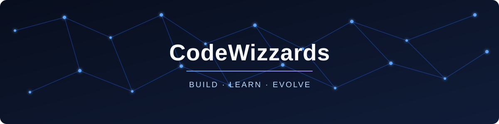

<p align="center">
  
</p>

<p align="center">
  <a href="https://github.com/CodeWizzards"></a>
  
  
</p>

---

## 🧭 Sobre mim

```ts
const codeWizzards = {
  focus: ["software", "experiências digitais", "soluções bem construídas"],
  mindset: "curiosidade, consistência e evolução contínua",
  currently: "aprendendo, criando e transformando ideias em produto",
  collaboration: "sempre aberto a conexões e boas conversas",
};
```

---

## ⚡ O que move meu trabalho

> Criar com intenção. Aprender rápido. Entregar com qualidade.

Este espaço está sendo construído aos poucos — com foco em evolução, boas práticas e tecnologia que resolve problemas de verdade.

---

## 📊 Atividade no GitHub

<p align="center">
  
  
</p>

<p align="center">
  
</p>

---

<p align="center">
  <sub>Feito com curiosidade e muito café ☕</sub>
</p>
