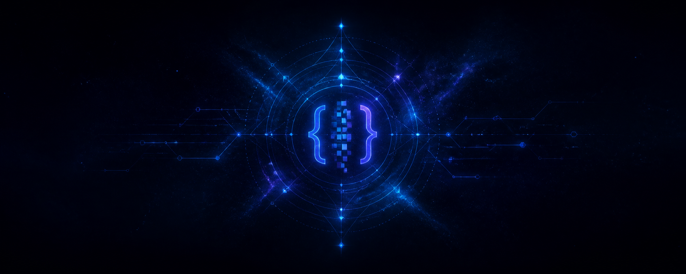

<p align="center">
  
</p>

<h1 align="center">CodeWizzards</h1>

<p align="center">
  
</p>

<p align="center">
  <a href="https://github.com/CodeWizzards"></a>
  
  
</p>

---

## ✦ A identidade por trás do código

```ts
const digitalAlchemist = {
  alias: "CodeWizzards",
  mission: "transformar ideias em experiências que fazem sentido",
  values: ["curiosidade", "clareza", "qualidade", "evolução"],
  currentState: "explorando possibilidades e lapidando o próximo capítulo",
  openTo: "conexões, aprendizados e conversas que geram movimento",
};
```

> Não se trata apenas de escrever código. Trata-se de dar forma ao que ainda não existe.

---

## ⚡ Em construção

<p align="center">
  
  
  
  
</p>

<p align="center">
  Este perfil é o meu laboratório digital: um lugar para aprender, testar e criar com intenção.
</p>

---

## 📡 Sinal do GitHub

<p align="center">
  
  
</p>

<p align="center">
  
</p>

---

<p align="center">
  <i>CodeWizzards — creating the next spell, one commit at a time.</i> ✦
</p>
